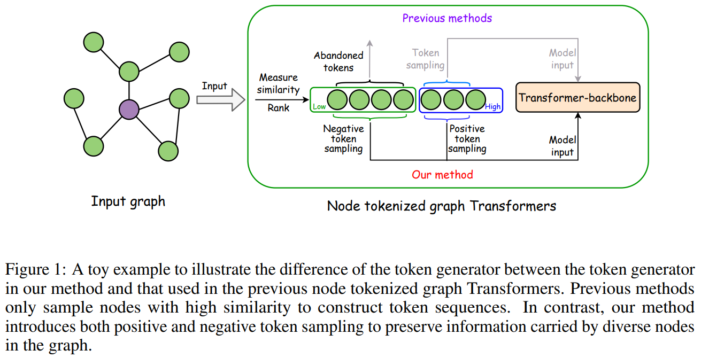

# GCFormer
This is the code for our NeurIPS 2024 paper 
[**Leveraging Contrastive Learning for Enhanced Node Representations in Tokenized Graph Transformers**](https://arxiv.org/pdf/2406.19258).



## Requirements
Python == 3.8

Pytorch == 1.11

dgl == 0.9

CUDA == 10.2


## Usage

You can run each command in "Solo.sh".

You could change the hyper-parameters of NAGphormer if necessary.

Due to the space limitation, please refer to this [link](https://drive.google.com/file/d/1i-cCsF1jEkJ9xNcEaOWftGkOZntAN4m5/view?usp=sharing) to download the datasets as well as pre-computing data. 
Once you have done this, please put them into the corresponding folders (dataset, pre_features and pre_sample)


## Cite
If you find this code useful, please consider citing the original work by authors:
```
@inproceedings{gcformer, 
author = {Jinsong Chen and Hanpeng Liu and John E. Hopcroft and Kun He},
 title = {Leveraging Contrastive Learning for Enhanced Node Representations in Tokenized Graph Transformers}, 
 booktitle = {Proceedings of the 38th Annual Conference on Neural Information Processing Systems}, 
 year = {2024} }
```